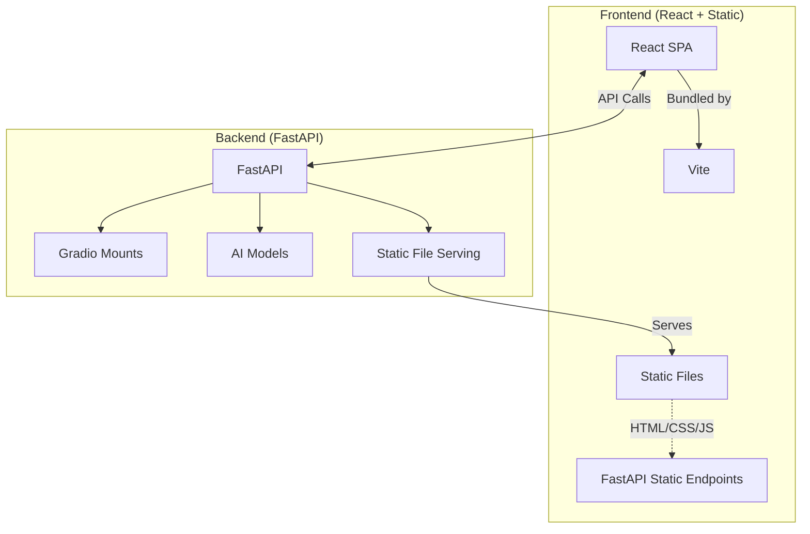
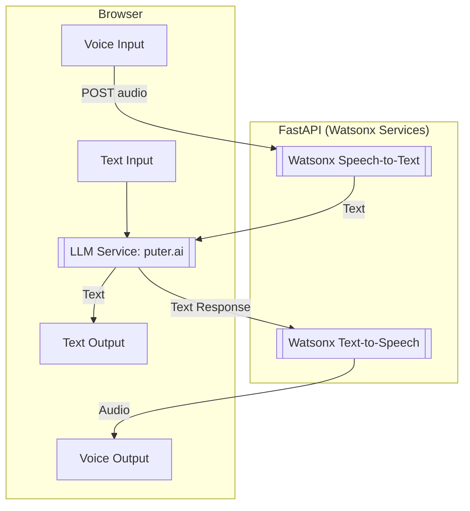
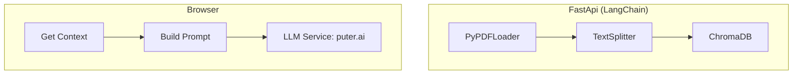
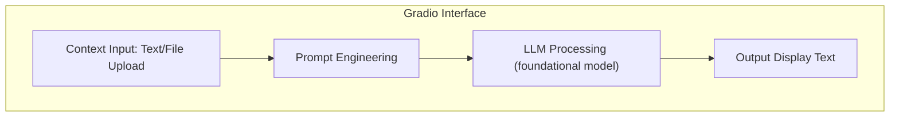

# 🤖 AI Tools Hub  
### **Full-Stack AI Application Suite with FastAPI, Gradio, and React**  

| Home | Tools |
| ------ | ------ |
|   |   |

---
## ⚓ Featured Tools  

| Tool | Description | Core Technologies |
| ----------------------- | ----------------------- | -----------------------  |
| **Face to Anime Portrait**<br> | Convert face images into Anime portraits | [AnimeGANv2](https://github.com/bryandlee/animegan2-pytorch), Gradio |
| | | |
| **Career Coach** <br> <br>| Role specific resume and cover letter tailoring  <br> <br> | Llama3, Gradio |
| | | |
| **Translator Voice Assistant**<br> | Translation with voice/text input and output. Current languages: English, French, German, Spanish, Italian, Portugese, Dutch, Japanese, and Korean | Llama3, Watsonx STT & TTS, FastAPI  |
| | | |
| **PDF Summarizer**<br>  | PDF document analysis with LLM and RAG | Llama3, LangChain, FastApi  |
| | | |
| **Voice Assistant**<br>  | Voice interactions with voice/text input and supports image analysis | GPT-4o, Watsonx STT & TTS, FastAPI  |
| | | |
| **Meeting Assistant**<br> | Audio transcripted meeting notes and action items | Whisper, Llama2, Gradio  |
| | | |
| **Image Captioning**<br> | Automated image captioning | BLIP, Gradio |
| | | |
| **Chatbot**<br> | Basic chatbot demo | Blenderbot, Transformers, FastApi |
| | | |

---
## ⚙️ System Architecture


---
## 🛠️ Tech Stack  

### Frontend  
| Component | Technology |  
|-----------|------------|  
| Main Interface | React + Vite |  
| Static Pages | HTML5, Bootstrap 5 |  
| Interactive Elements | jQuery |  

### Backend  
| Service | Technology |  
|---------|------------|  
| API Server | FastAPI |  
| AI Tools Interface | Gradio |  
| Chat Engine | Llama3, Llama2, GPT-4o |
| RAG | LangChain |
| Voice Processing | Watsonx STT/TTS |  

---
## ✨ Key Features  

1. **Multi-Tool Dashboard**  
   - Unified interface for 7 AI assistants  
   - Responsive grid layout with dark/light mode  

2. **Advanced AI Integration**  






3. **CI/CD Pipeline**
    - Docker containerization
    - Netlify frontend deployment

---
## Run the App Locally

1. Clone the repository

2. Navigate to the project directory
    ```bash
    cd AI-Assistants-Fullstack
    ```

3. Set up Frontend
    ```bash
    cd frontend
    ```
   * App.jsx under ./src
        * For development, set VITE_BASE_URL = http://127.0.0.1:10000 under .env in the frontend root folder
        * For Vite, import statement: import.meta.env.VITE_BASE_URL
        * For production, set VITE_BASE_URL = https://repo-name.onrender.com under environmental variables on gh-pages and Render
    
    ```bash
    npm install
    nom run build
    ```

5. Set up Backend
    ```bash
    cd ../backend
    python3 -m venv venv
    venv\Scripts\activate   ## on MacOS and Linux : source venv/bin/activate
    pip install -r requirements.txt

    python -u server.py --reload
    or
    uvicorn server:app --host 127.0.0.1 --port 10000

    ```
    * .env in the backend root folder should contain the following
        * watsonx_API, project_id: from Watsonx.ai 
        * TTS_API_KEY, TTS_SERVICE_URL: from IBM Cloud TTS service
        * STT_API_KEY, STT_SERVICE_URL: from IBM Cloud STT service

6. Open browser and go to `http://localhost:10000/` to view the application
---